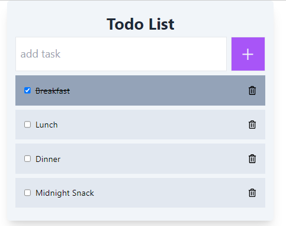

# Digital Awesome Development Test Project

# Laravel + React To Do List App
Todo App built with Laravel and React

## To Setup

Make sure you have environment setup properly. You will need PHP8.1, composer and Node.js.

1. Download the project (or clone using GIT)
2. Navigate to the `todo-app` folder
3. copy `.env.example` into `.env` and configure database credentials
4. Run `composer install`
5. Set the encryption key by executing `php artisan key:gen`
6. Run migrations `php artisan migrate --seed`
7. Start local server by executing `php artisan serve`
8. Open new terminal and navigate to the `react` folder
9. Copy `react/.env.example` into `.env` and adjust the `VITE_API_BASE_URL` parameter
9. Run `npm install`
10. Run `npm run dev` to start vite server for React

## Screenshot

